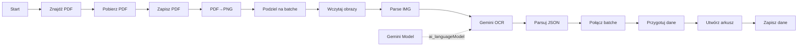

# 🤖 n8n-MCP Expert: Workflow Creation Prompt

## 📋 **ZADANIE: Stwórz kompletny workflow do ekstrakcji transakcji bankowych z PDF do Google Sheets**

### **Wymagania funkcjonalne:**

1. **Input:**

   - PDF wyciągu bankowego z Google Drive (wyszukiwanie po nazwie pliku i folder ID)
   - Nazwa pliku: `tab3_bank_20-105.pdf`
   - Folder ID: `1jBWaOmYLz5CZmclpCou81JMEQ7QIeMud`

2. **Proces:**

   - Konwersja PDF → obrazy PNG (300 DPI, wszystkie strony)
   - Podział stron na batche po 15 stron (optymalizacja kosztów AI)
   - OCR z użyciem **Gemini 2.0 Flash** (multimodal vision)
   - Ekstrakcja transakcji bankowych w formacie JSON
   - Agregacja wszystkich batch'y
   - Zapis do nowego arkusza w istniejącym Google Sheets

3. **Output:**

   - Google Sheets z tabelą transakcji
   - Spreadsheet ID: `1ivNmZbipxUH9c3UzUha87rsPGAugn8Fk8T1HLxhVaiI`
   - Nazwa arkusza: taka sama jak nazwa pliku PDF (bez `.pdf`)
   - Kolumny: `Data księgowania`, `Tytuł operacji`, `Kwota Operacji`, `Nadawca/Odbiorca`

4. **Format danych transakcji:**

   - **Data księgowania**: DD.MM.YYYY
   - **Tytuł operacji**: pełny tekst (zamień `\n` na spację)
   - **Kwota**: format XXXX,XX (przecinek jako separator dziesiętny)
   - **Nadawca/Odbiorca**: TYLKO nazwa firmy (bez numerów przesyłek, dat nadania, itp.)

5. **Zasady ekstrakcji:**
   - Wyciągnij WSZYSTKIE transakcje zaczynające się od "Z R-ku:"
   - Pomiń linie z "DATA NADANIA" (to nie są daty księgowania)
   - Każda transakcja = jeden wiersz w Google Sheets

---

## 🎯 **INSTRUKCJE DLA n8n-MCP EXPERT:**

### **Phase 1: Discovery & Planning (OBOWIĄZKOWE)**

1. **Wyszukaj templates podobne do zadania:**

   ```
   search_templates("PDF OCR vision AI bank statement extraction")
   ```

   - Sprawdź template **#2421** ("Transcribing Bank Statements To Markdown Using Gemini Vision AI")
   - Zidentyfikuj najlepsze praktyki z popularnych templates

2. **Sprawdź essentials dla kluczowych nodów:**

   ```
   get_node_essentials("nodes-langchain.agent", includeExamples=true)
   get_node_essentials("nodes-langchain.lmChatGoogleGemini", includeExamples=true)
   get_node_essentials("nodes-base.aggregate", includeExamples=true)
   ```

3. **Zweryfikuj dostępność nodów:**
   - Użyj `search_nodes()` do sprawdzenia alternatyw
   - Upewnij się, że wszystkie nody są dostępne w n8n

---

### **Phase 2: Workflow Architecture (ZAPROJEKTUJ PRZED BUDOWANIEM)**

**Struktura workflow (14 nodów):**



---

### **Phase 3: Node Implementation (SZCZEGÓŁY KONFIGURACJI)**

#### **Node 1: Start** (Manual Trigger)

```javascript
type: "n8n-nodes-base.manualTrigger";
position: [240, 400];
```

#### **Node 2: Znajdź PDF** (Google Drive)

```javascript
type: "n8n-nodes-base.googleDrive"
parameters: {
  resource: "fileFolder",
  searchMethod: "query",
  queryString: "name='tab3_bank_20-105.pdf' and '1jBWaOmYLz5CZmclpCou81JMEQ7QIeMud' in parents",
  limit: 1
}
credentials: googleDriveOAuth2Api
```

#### **Node 3: Pobierz PDF** (Google Drive)

```javascript
type: "n8n-nodes-base.googleDrive"
parameters: {
  operation: "download",
  fileId: "={{ $json.id }}"
}
```

#### **Node 4: Zapisz PDF** (Write Binary File)

```javascript
type: "n8n-nodes-base.writeBinaryFile"
parameters: {
  fileName: "=/tmp/n8n-pdf-{{ $now.toMillis() }}.pdf",
  dataPropertyName: "data"
}
```

#### **Node 5: PDF→PNG** (Execute Command)

```bash
PDF="{{ $('Zapisz PDF').item.json.fileName }}"
OUT="/tmp/$(basename "$PDF" .pdf)-img"
mkdir -p "$OUT"
pdftoppm -png -r 300 "$PDF" "$OUT/p"
echo "OUT:$OUT|CNT:$(ls "$OUT"/*.png|wc -l)"
```

**UWAGA:** Wymaga zainstalowanego `poppler-utils` w kontenerze n8n!

#### **Node 6: Podziel na batche** (Code)

```javascript
// KRYTYCZNE: NIE używaj require('fs') - n8n blokuje ten moduł!
const stdout = $input.item.json.stdout || "";
const match = stdout.match(/OUT:(.+)\|CNT:(\d+)/);

if (!match) throw new Error("Parse error");

const outDir = match[1];
const pageCount = parseInt(match[2]);

// Generuj listę plików bez fs.readdir()
const files = [];
for (let i = 1; i <= pageCount; i++) {
  const paddedNum = String(i).padStart(pageCount > 99 ? 3 : 2, "0");
  files.push(`${outDir}/p-${paddedNum}.png`);
}

const BATCH_SIZE = 15;
const batches = [];

for (let i = 0; i < files.length; i += BATCH_SIZE) {
  const batchFiles = files.slice(i, i + BATCH_SIZE);
  batches.push({
    batch: Math.floor(i / BATCH_SIZE) + 1,
    total: Math.ceil(files.length / BATCH_SIZE),
    start: i + 1,
    end: Math.min(i + BATCH_SIZE, files.length),
    fileList: batchFiles.join(" "),
  });
}

return batches.map((b) => ({ json: b }));
```

#### **Node 7: Wczytaj obrazy** (Execute Command)

```bash
# KRYTYCZNE: Używaj bash zamiast Code node (brak dostępu do fs w Code!)
FILES="{{ $json.fileList }}"
echo -n '['
FIRST=true
for img in $FILES; do
  if [ -f "$img" ]; then
    [ "$FIRST" = false ] && echo -n ','
    FIRST=false
    BASE64=$(base64 -w 0 "$img" 2>/dev/null || base64 "$img")
    echo -n '{"inlineData":{"mimeType":"image/png","data":"'"$BASE64"'"}}'
  fi
done
echo ']'
```

#### **Node 8: Parse IMG** (Code)

```javascript
const images = JSON.parse($input.item.json.stdout || "[]");
return {
  json: {
    batch: $input.item.json.batch,
    total: $input.item.json.total,
    start: $input.item.json.start,
    end: $input.item.json.end,
    images: images,
  },
};
```

#### **Node 9: Gemini Model** (Language Model)

```javascript
type: "@n8n/n8n-nodes-langchain.lmChatGoogleGemini"
parameters: {
  modelName: "gemini-2.0-flash-exp",
  options: {
    maxOutputTokens: 32000
  }
}
credentials: googleGeminiOAuth2Api
```

**UWAGA:** Ten node musi być połączony z AI Agent przez `ai_languageModel` connection!

#### **Node 10: Gemini OCR** (AI Agent)

```javascript
type: "@n8n/n8n-nodes-langchain.agent"
parameters: {
  promptType: "define",
  text: `=Wyciągnij WSZYSTKIE transakcje bankowe z tych obrazów.

**Format JSON (bez markdown!):**
\`\`\`json
{"transactions":[{"date":"DD.MM.YYYY","title":"Pełny tytuł","amount":"XXXX,XX","sender":"Nazwa firmy"}]}
\`\`\`

**Zasady:**
1. Data księgowania: format DD.MM.YYYY
2. Tytuł: pełny tekst (zamień \\n na spację)
3. Kwota: format XXXX,XX (przecinek!)
4. Nadawca: TYLKO nazwa firmy (bez numerów przesyłek, dat nadania)
5. Wyciągnij WSZYSTKIE wiersze z "Z R-ku:"
6. Pomiń "DATA NADANIA"

Obrazki zawierają strony {{ $json.start }}-{{ $json.end }}/{{ $('Podziel na batche').all()[0].json.total*15 }}.

Obrazy:
{{ JSON.stringify($json.images) }}`
}
```

**KRYTYCZNE:** Połącz `Gemini Model` → `Gemini OCR` używając `ai_languageModel` connection type!

#### **Node 11: Parsuj JSON** (Code)

````javascript
let txt = ($input.item.json.output || "").trim();

// Usuń markdown code blocks
if (txt.includes("```")) {
  txt = txt
    .replace(/```json\n?/gi, "")
    .replace(/```\n?/g, "")
    .trim();
}

// Wyciągnij JSON
const m = txt.match(/\{[\s\S]*\}/);
if (m) txt = m[0];

const p = JSON.parse(txt);
const txs = p.transactions || [];

console.log(`✅ Batch ${$input.item.json.batch}: ${txs.length} transakcji`);

return {
  json: {
    batch: $input.item.json.batch,
    transactions: txs,
  },
};
````

#### **Node 12: Połącz batche** (Aggregate)

```javascript
type: "n8n-nodes-base.aggregate";
parameters: {
  aggregate: "aggregateAllItemData";
}
```

#### **Node 13: Przygotuj dane** (Code)

```javascript
const all = $input.all();
const txs = [];

for (const b of all) {
  txs.push(...(b.json.transactions || []));
}

const fn = $("Znajdź PDF").first().json.name;
const sn = fn.replace(".pdf", "");

const hdr = [
  "Data księgowania",
  "Tytuł operacji",
  "Kwota Operacji",
  "Nadawca/Odbiorca",
];
const rows = [
  hdr,
  ...txs.map((t) => [
    t.date || "",
    t.title || "",
    t.amount || "",
    t.sender || "",
  ]),
];

console.log(`✅ Łącznie: ${txs.length} transakcji`);

return {
  json: {
    sheetName: sn,
    spreadsheetId: "1ivNmZbipxUH9c3UzUha87rsPGAugn8Fk8T1HLxhVaiI",
    rows: rows,
  },
};
```

#### **Node 14: Utwórz arkusz** (HTTP Request)

```javascript
type: "n8n-nodes-base.httpRequest"
parameters: {
  method: "POST",
  url: "=https://sheets.googleapis.com/v4/spreadsheets/{{ $json.spreadsheetId }}:batchUpdate",
  authentication: "predefinedCredentialType",
  nodeCredentialType: "googleSheetsOAuth2Api",
  sendBody: true,
  specifyBody: "json",
  jsonBody: "={{ JSON.stringify({requests:[{addSheet:{properties:{title:$json.sheetName}}}]}) }}"
}
```

#### **Node 15: Zapisz dane** (HTTP Request)

```javascript
type: "n8n-nodes-base.httpRequest"
parameters: {
  method: "PUT",
  url: "=https://sheets.googleapis.com/v4/spreadsheets/{{ $('Przygotuj dane').first().json.spreadsheetId }}/values/{{ $('Przygotuj dane').first().json.sheetName }}!A1?valueInputOption=RAW",
  authentication: "predefinedCredentialType",
  nodeCredentialType: "googleSheetsOAuth2Api",
  sendBody: true,
  specifyBody: "json",
  jsonBody: "={{ JSON.stringify({values:$('Przygotuj dane').first().json.rows}) }}"
}
```

---

### **Phase 4: Validation (PRZED DEPLOYMENTEM)**

1. **Waliduj każdy node:**

   ```
   validate_node_minimal(nodeType, config)
   validate_node_operation(nodeType, config, 'runtime')
   ```

2. **Waliduj cały workflow:**

   ```
   validate_workflow(workflow)
   validate_workflow_connections(workflow)
   validate_workflow_expressions(workflow)
   ```

3. **Napraw wszystkie błędy przed utworzeniem workflow**

---

### **Phase 5: Deployment**

1. **Utwórz workflow:**

   ```
   n8n_create_workflow(name, nodes, connections, settings)
   ```

2. **Waliduj po utworzeniu:**

   ```
   n8n_validate_workflow(workflowId)
   ```

3. **Jeśli są błędy, użyj autofix:**
   ```
   n8n_autofix_workflow(workflowId, applyFixes=true)
   ```

---

## ⚠️ **KRYTYCZNE UWAGI (MUST READ!):**

### **1. Moduł `fs` jest ZABLOKOWANY w Code node!**

```javascript
// ❌ NIE DZIAŁA
const fs = require("fs");
const fs = require("fs").promises;

// ✅ ROZWIĄZANIE: Użyj Execute Command node zamiast Code
```

### **2. AI Agent wymaga połączenia z Language Model!**

```javascript
// KRYTYCZNE: Połączenie MUSI być typu 'ai_languageModel'
connections: {
  "Gemini Model": {
    "ai_languageModel": [[{
      "node": "Gemini OCR",
      "type": "ai_languageModel",
      "index": 0
    }]]
  }
}
```

### **3. Gemini credentials - wybierz istniejące!**

```
Nie używaj placeholder "YOUR_GEMINI_CRED_ID" -
w node "Gemini Model" użytkownik MUSI wybrać swoje credentials ręcznie w UI.
```

### **4. Instalacja zależności w kontenerze:**

```bash
# Tesseract NIE JEST potrzebny (używamy Gemini Vision)
# Poppler-utils JEST potrzebny (pdftoppm)

docker exec -u root n8n-local apk add poppler-utils
```

### **5. Optymalizacja kosztów:**

- Batch size = 15 stron (balans między prędkością a kosztem)
- Model: `gemini-2.0-flash-exp` (tańszy niż Pro)
- maxOutputTokens: 32000 (wystarczające dla 15 stron)

---

## 📊 **Expected Output:**

**Workflow ID:** (wygenerowany automatycznie)  
**Nazwa:** "Gemini Vision: Wyciągi bankowe → Google Sheets"  
**Liczba nodów:** 15  
**Czas wykonania:** ~5-10 minut (dla 100-120 stron)  
**Koszt:** ~$0.10-0.20 (jednorazowy)

---

## 🎯 **Success Criteria:**

✅ Workflow utworzony i zwalidowany bez błędów  
✅ Wszystkie nody poprawnie połączone  
✅ AI Agent połączony z Gemini Model przez `ai_languageModel`  
✅ Brak użycia modułu `fs` w Code nodes  
✅ Google Sheets credentials skonfigurowane  
✅ Workflow gotowy do uruchomienia (wymaga tylko wyboru Gemini credentials w UI)

---

## 📚 **MANDATORY ATTRIBUTION (jeśli użyto template):**

```
Based on template by **Jimleuk** (@jimleuk)
View at: https://n8n.io/workflows/2421
```

---

## 🚀 **Final Checklist przed dostarczeniem:**

- [ ] Wszystkie nody utworzone i skonfigurowane
- [ ] Wszystkie połączenia (main + ai_languageModel) działają
- [ ] Brak błędów walidacji
- [ ] Kod nie używa zablokowanych modułów (fs, path, crypto z require)
- [ ] Credentials ID są poprawne lub oznaczone jako "do uzupełnienia przez użytkownika"
- [ ] Workflow przetestowany (jeśli możliwe)
- [ ] Dokumentacja i instrukcje dostarczone użytkownikowi

---

## 💡 **Tips for AI Agent:**

1. **ZAWSZE** zaczynaj od `search_templates()` i `get_node_essentials()`
2. **NIGDY** nie używaj `require('fs')` w Code node
3. **ZAWSZE** waliduj przed utworzeniem workflow
4. **PREFERUJ** batch operations zamiast pojedynczych aktualizacji
5. **UŻYWAJ** `ai_languageModel` connection type dla AI Agent
6. **SPRAWDŹ** czy wszystkie credentials są dostępne
7. **DODAJ** szczegółowe logi w Code nodes (`console.log`)
8. **OPTYMALIZUJ** koszty (batch size, model selection)

---

**KONIEC PROMPTU**
