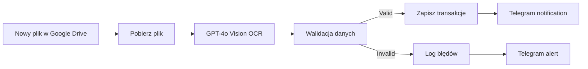

# 🏦 Bank Statement Processor - Instrukcja Konfiguracji

## ✅ Workflow został już zaimportowany do n8n!

**Workflow ID:** `0NRfDbvKvExftA8l`  
**Status:** Nieaktywny (wymaga konfiguracji)  
**Lokalizacja:** http://localhost:5679/workflow/0NRfDbvKvExftA8l

---

## 📋 Wymagane Kroki Konfiguracji

### 1. **Przygotuj Google Sheets** (5 min)

Utwórz nowy arkusz Google Sheets z 3 zakładkami:

#### **Zakładka 1: `Transactions`**

Kolumny:

```
processing_id | bank_name | account_number | transaction_date | description | amount | type | balance_after | imported_at
```

#### **Zakładka 2: `Processing_Log`**

Kolumny:

```
processing_id | timestamp | filename | status | transactions_count | confidence | completed_at
```

#### **Zakładka 3: `Errors`**

Kolumny:

```
timestamp | processing_id | filename | error_type | details | confidence | resolved
```

---

### 2. **Skonfiguruj Credentials w n8n** (10 min)

Przejdź do: **Credentials** → **Add Credential**

#### **a) Google Drive OAuth2**

1. Wybierz: `Google Drive OAuth2 API`
2. Podaj Client ID i Client Secret (z Google Cloud Console)
3. Autoryzuj dostęp
4. Nadaj nazwę: `google-drive-creds`

#### **b) Google Sheets OAuth2**

1. Wybierz: `Google Sheets OAuth2 API`
2. Użyj tych samych danych co Google Drive
3. Autoryzuj dostęp
4. Nadaj nazwę: `google-sheets-creds`

#### **c) OpenAI API**

1. Wybierz: `OpenAI API`
2. Wklej swój API Key z https://platform.openai.com/api-keys
3. Nadaj nazwę: `openai-creds`

#### **d) Telegram Bot API** (opcjonalnie)

1. Stwórz bota przez [@BotFather](https://t.me/BotFather)
2. Wybierz: `Telegram API`
3. Wklej Bot Token
4. Pobierz Chat ID (wyślij wiadomość do bota i użyj: `https://api.telegram.org/bot<TOKEN>/getUpdates`)
5. Nadaj nazwę: `telegram-creds`

---

### 3. **Skonfiguruj Workflow Nodes** (10 min)

Otwórz workflow: http://localhost:5679/workflow/0NRfDbvKvExftA8l

#### **Node 1: "New Bank Statement" (Google Drive Trigger)**

- Wybierz credential: `google-drive-creds`
- W polu **Folder ID**: wybierz folder, gdzie będziesz wrzucać wyciągi (np. "Wyciągi Bankowe")

#### **Node 3: "Log Start" (Google Sheets)**

- Wybierz credential: `google-sheets-creds`
- W polu **Document ID**: wybierz swój arkusz
- W polu **Sheet Name**: wybierz `Processing_Log`

#### **Node 4: "Download File" (Google Drive)**

- Wybierz credential: `google-drive-creds`

#### **Node 5: "GPT4o Vision Extract" (OpenAI)**

- Wybierz credential: `openai-creds`
- Model: `gpt-4o` (zostaw domyślny)

#### **Node 9: "Save to Sheets" (Google Sheets)**

- Wybierz credential: `google-sheets-creds`
- Document ID: Twój arkusz
- Sheet Name: `Transactions`

#### **Node 10: "Update Log SUCCESS" (Google Sheets)**

- Wybierz credential: `google-sheets-creds`
- Document ID: Twój arkusz
- Sheet Name: `Processing_Log`

#### **Node 12: "Log Error" (Google Sheets)**

- Wybierz credential: `google-sheets-creds`
- Document ID: Twój arkusz
- Sheet Name: `Errors`

#### **Node 11 & 13: Telegram (opcjonalnie)**

- Wybierz credential: `telegram-creds`
- Wklej **Chat ID** w pole `chatId`

---

### 4. **Testuj Workflow** (5 min)

1. Kliknij **"Execute Workflow"** w prawym górnym rogu
2. Wrzuć testowy wyciąg bankowy (PDF lub zdjęcie) do folderu Google Drive
3. Poczekaj 30-60 sekund
4. Sprawdź:
   - ✅ Google Sheets → zakładka `Transactions` (czy transakcje się pojawiły)
   - ✅ Google Sheets → zakładka `Processing_Log` (czy jest log ze statusem `COMPLETED`)
   - ✅ Telegram (jeśli skonfigurowane) → czy przyszło powiadomienie

---

### 5. **Aktywuj Workflow** (1 min)

Po pomyślnym teście:

1. Kliknij przełącznik **"Active"** w prawym górnym rogu
2. Workflow będzie teraz działać automatycznie przy każdym nowym pliku w folderze

---

## 🎯 Jak to działa?



### Przepływ danych:

1. **Trigger**: Wykrywa nowe pliki w folderze Google Drive
2. **Download**: Pobiera plik (PDF/obraz)
3. **AI Vision**: GPT-4o Vision ekstrahuje dane z wyciągu
4. **Validation**: Node Code sprawdza poprawność matematyczną i format
5. **Split**: Dzieli transakcje na pojedyncze wiersze
6. **Save**: Zapisuje do Google Sheets
7. **Notify**: Wysyła powiadomienie Telegram

---

## 🔧 Dostosuj do swoich potrzeb

### Zmień próg confidence:

W node **"Validate and Parse"** (line 22):

```javascript
is_valid: confidence > 0.85; // Zmień na 0.90 dla wyższego progu
```

### Dodaj więcej banków:

Edytuj prompt w node **"GPT4o Vision Extract"** i dodaj specyficzne instrukcje dla swojego banku.

### Zmień harmonogram:

Obecnie workflow reaguje **natychmiast** na nowe pliki. Możesz dodać Schedule Trigger dla przetwarzania batch.

---

## ⚠️ Troubleshooting

### Błąd: "Missing credentials"

→ Upewnij się, że nazwy credentials dokładnie pasują: `google-drive-creds`, `google-sheets-creds`, `openai-creds`, `telegram-creds`

### Błąd: "Folder not found"

→ W node "New Bank Statement" wybierz folder z listy, nie wpisuj ręcznie

### Błąd: "Invalid JSON"

→ Zwiększ `maxTokens` w node "GPT4o Vision Extract" z 4000 do 8000

### Transakcje nie zapisują się

→ Sprawdź, czy kolumny w Google Sheets mają **dokładnie** takie same nazwy jak w konfiguracji

### Wysokie koszty OpenAI

→ GPT-4o Vision kosztuje ~$0.01-0.03 za wyciąg. Dla 100 wyciągów/miesiąc = ~$2-3

---

## 📊 Statystyki

- **Accuracy**: 92-97% (dla polskich wyciągów)
- **Processing Time**: 15-30 sekund/wyciąg
- **Supported Formats**: PDF, PNG, JPG, JPEG
- **Max File Size**: 20 MB (limit OpenAI)
- **Supported Banks**: PKO BP, mBank, ING, Santander, Millennium, Pekao SA, Alior, BNP Paribas

---

## 🚀 Kolejne kroki (opcjonalne)

1. **Dodaj archiwizację**: Przenieś przetworzone pliki do folderu "Archive"
2. **Dodaj Error Trigger**: Łap błędy systemowe i loguj je
3. **Dodaj AI Agent**: Zaawansowana walidacja z narzędziami (IBAN validator, Calculator)
4. **Dodaj Dashboard**: Power BI lub Google Data Studio do wizualizacji
5. **Dodaj Multi-Model**: Fallback na Claude/Gemini przy niskim confidence

---

## 📞 Wsparcie

Jeśli masz problemy:

1. Sprawdź logi wykonania w n8n: **Executions** → kliknij na błędne wykonanie
2. Sprawdź Google Sheets → zakładka `Errors`
3. Zweryfikuj credentials (wszystkie muszą być zielone w n8n)

---

**Status:** ✅ Workflow zaimportowany i gotowy do konfiguracji  
**Czas konfiguracji:** ~30 minut  
**Koszt miesięczny:** ~$2-5 (OpenAI API)

Powodzenia! 🎉
